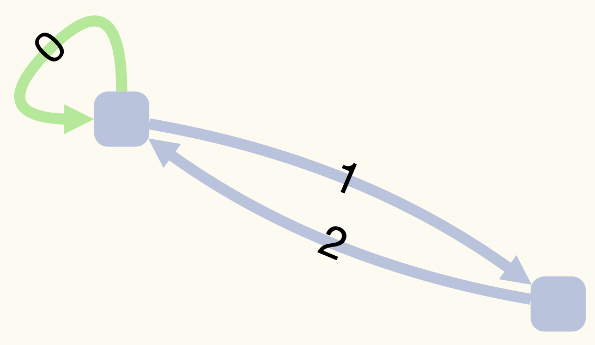

# gwplus: GraphWalker Plus

Computes the shortest test path satisfying a coverage criterion for a GraphWalker model.

## Table of Contents

* [How to Build](#how-to-build)
* [Usage](#usage)
* [Examples](#examples)
    - [Toy Graph](#toy-graph)
    - [TLC](#tlc)
    
## How to Build

Open a terminal and clone this repository using the following command:

```
git clone https://github.com/yavuzkoroglu/gwplus.git
```

Change the directory to the repository:

```
cd gwplus
``` 

Now, build the executable files:

* **NOTE**: `make` with no parameters compile the executables in `MODE=debug`. Then, `gwplus` may perform slower than usual.

```
make -e MODE=release
```

Now, you are ready to use `gwplus`:

```
bin/gwplus
```

The command above shows how to use `gwplus`.
## Usage

`gwplus` usage syntax is:

```
Usage: gwplus (edge|prime) <GraphWalker-JSON-file> <output-JSON-file> [-v]
```

## Examples

### Toy Graph



Use the following command to generate the test path that satisfy prime path coverage for the graph above:

```
bin/gwplus prime examples/toygraph/wellformed.json testpath.json -v
```

The output of the command above should be:

```
[2024-02-21 15:52:37] - Verbose enabled.
[2024-02-21 15:52:37] - Coverage Criterion = Prime Path Coverage
[2024-02-21 15:52:37] - Loading examples/toygraph/wellformed.json...
[2024-02-21 15:52:37] - Starting Element is an EDGE
[2024-02-21 15:52:37] -          # Vertices = 2
[2024-02-21 15:52:37] -             # Edges = 3
[2024-02-21 15:52:37] -        # Edge Pairs = 5
[2024-02-21 15:52:37] - # Test Requirements = 6
[2024-02-21 15:52:37] -    # Direct Splices = 14
[2024-02-21 15:52:37] -        # HyperPaths = 2
[2024-02-21 15:52:37] -         # TestPaths = 1
[2024-02-21 15:52:37] -  LengthOf(TestPath) = 9
[2024-02-21 15:52:37] - Dumping the final model to testpath.json...
[2024-02-21 15:52:37] - Finished
```

GraphWalker should be able to reproduce the test located in the resulting `testpath.json` file.

Use the following command to see some of the internal variables computed to generate the test path:

```
bin/toygraph
```

### TLC

For edge coverage:

```
bin/gwplus edge examples/tlc/wellformed.json testpath.json
```

For prime coverage:

```
bin/gwplus prime examples/tlc/wellformed.json testpath.json
```

**WARNING**: The above command for prime path coverage may take a while!
