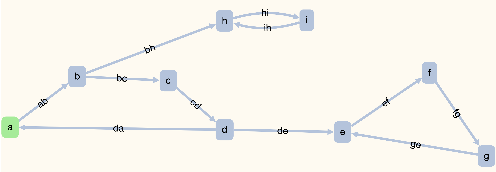
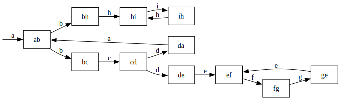
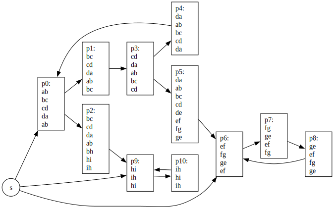
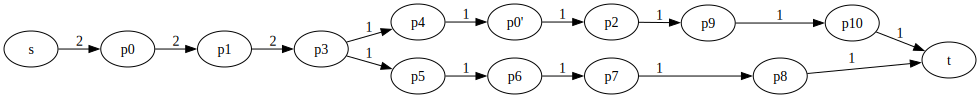

# Gwplus: GraphWalker Plus

Computes short test case(s) that satisfies a coverage criterion for a GraphWalker model.

<!--
## Table of Contents

* [How to Build](#how-to-build)
* [Usage](#usage)
* [Experiments](#experiments)

## How to Build

Open a terminal execute the following command to build `gwplus`:

```
make -e MODE=release
```

Now, you are ready to use `gwplus`. Execute the following command to see how to use `gwplus`.

```
bin/gwplus
```

## Usage

You should obtain the following output after executing `bin/gwplus`:

```
GWPlus: Fast Optimal Test Generator for GraphWalker

Usage: gwplus -i <json-file> [options]

GENERAL OPTIONS:
  -c,--coverage COVERAGE       Set the coverage criterion
  -C,--copyright               Output the copyright message and exit
  -f,--finalgraph DOT-FILE     Outputs the finel test plan to a DOT file
  -H,--help                    Output this help message and exit
  -h,--hyperpathgraph DOT-FILE Output the hyperpath graph to a DOT file
  -i,--input JSON-FILE         (Mandatory) An input GraphWalker model in JSON format
  -m,--measure TXT-FILE(s)     Output coverage of custom test(s)
  -n,--netflow DOT-FILE        Output the minimum flow graph to a DOT file
  -p,--pathgraph DOT-FILE      Output the path graph to a DOT file
  -r,--requirements TXT-FILE   Output the test requirements to a TXT file
  -s,--simplegraph DOT-FILE    Output the simple graph to a DOT file
  -t,--tests JSON-FILE [PRCNT] Output test(s) with PRCNT% coverage (Default: 100%)
  -u,--unify JSON-FILE         Output a unified GraphWalker model with no tests
  -v,--verbose                 Timestamped status information to stdout
  -V,--version                 Output version number and exit

COVERAGE OPTIONS:
  vertex                       Vertices of a GraphWalker model
  edge                         (Default) Edges of a GraphWalker model
  edgepair                     Edge-pairs of a GraphWalker model
  edgetriple                   Edge-triples of a GraphWalker model
  NUMBER                       Edge paths up to a length (0=vertex, 1=edge, etc.)
  prime1                       Prime vertex paths of a GraphWalker model
  prime2                       Prime vertex paths and edges of a GraphWalker model
  prime3                       Prime edge paths of a GraphWalker model
  TXT-FILE                     Custom test requirements from a TXT file

EXAMPLE USES:
  bin/gwplus -i exps/001/m.json -c prime3 -s s.dot -p p.dot -f f.dot -t t.json -v
  bin/gwplus -i exps/001/m.json -m exps/001/generated/t2.txt
  bin/gwplus -i exps/001/m.json -c 0 -m exps/001/generated/t1.txt exps/001/generated/t2.txt
```

### Example #1

```
bin/gwplus -i exps/001/m.json -c prime3 -s s.dot -p p.dot -f f.dot -t t.json -v
```

The first option in this example is `-i exps/001/m.json`. This option sets the input GraphWalker model to a toy graph whose meta information is in `exps/001/info.json`. When opened in GraphWalker studio, this toy graph appears as follows:



The second option `-c prime3` sets the coverage criterion to the highest setting.

The third option `-s s.dot` saves the simple graph of the toy graph. For coverage criteria settings higher than vertex coverage, the simple graph is a *line graph*, i.e., a graph where all edges are vertices and vice versa. After executing the example command, you can print the simple graph to the terminal using `cat s.dot` and produce the following result:

```
digraph SimpleGraph {
    rankdir=LR;
    node [shape="rectangle"];
    reset [shape="none", label="", width=0, height=0];
    10 [label="ih"];
    9 [label="hi"];
    8 [label="bh"];
    7 [label="ge"];
    6 [label="fg"];
    5 [label="ef"];
    4 [label="de"];
    3 [label="da"];
    2 [label="cd"];
    1 [label="bc"];
    0 [label="ab"];
    reset -> 0 [label="a"];
    10 -> 9 [label="h"];
    9 -> 10 [label="i"];
    8 -> 9 [label="h"];
    7 -> 5 [label="e"];
    6 -> 7 [label="g"];
    5 -> 6 [label="f"];
    4 -> 5 [label="e"];
    3 -> 0 [label="a"];
    2 -> 4 [label="d"];
    2 -> 3 [label="d"];
    1 -> 2 [label="c"];
    0 -> 8 [label="b"];
    0 -> 1 [label="b"];
}
```

A visualization of the above DOT graph is as follows:



The fourth option `-p p.dot` saves the path graph of test requirements. A visualization of the path graph is below:



The fifth option `-f f.dot` saves the final test plan. A visualization of the test plan is below:



The sixth option `-t t.json` saves the model + a list of predefinedEdgeIds denoting a test path that satisfies the *prime3* coverage criterion. For this example, `gwplus` produces two test models. You can give the second test model to GraphWalker CLI using the following command:

```
java -jar graphwalker-cli-4.3.2.jar offline -m t_2.json "predefined_path(predefined_path)"
```

The GraphWalker CLI output should look like as follows:

```
{"currentElementName":"a"}
{"currentElementName":"ab"}
{"currentElementName":"b"}
{"currentElementName":"bc"}
{"currentElementName":"c"}
{"currentElementName":"cd"}
{"currentElementName":"d"}
{"currentElementName":"da"}
{"currentElementName":"a"}
{"currentElementName":"ab"}
{"currentElementName":"b"}
{"currentElementName":"bc"}
{"currentElementName":"c"}
{"currentElementName":"cd"}
{"currentElementName":"d"}
{"currentElementName":"da"}
{"currentElementName":"a"}
{"currentElementName":"ab"}
{"currentElementName":"b"}
{"currentElementName":"bh"}
{"currentElementName":"h"}
{"currentElementName":"hi"}
{"currentElementName":"i"}
{"currentElementName":"ih"}
{"currentElementName":"h"}
{"currentElementName":"hi"}
{"currentElementName":"i"}
{"currentElementName":"ih"}
{"currentElementName":"h"}
```

The final option `-v` enables verbose messages in output. A correct execution should produce something similar to the following timestamped output:

```
[2024-07-27 13:50:48] - Verbose enabled.
[2024-07-27 13:50:48] - MODE = release
[2024-07-27 13:50:48] - Input Model File = exps/001/m.json
[2024-07-27 13:50:48] - Coverage Criterion = Prime Edge Path Coverage
[2024-07-27 13:50:48] - Simple Graph Name = s.dot
[2024-07-27 13:50:48] - Path Graph File = p.dot
[2024-07-27 13:50:48] - Final Test Plan File = f.dot
[2024-07-27 13:50:48] - Output Model File with Predefined Edges = t.json
[2024-07-27 13:50:48] - Coverage Percent = 100%
[2024-07-27 13:50:48] - Creating Empty GraphWalker Model...
[2024-07-27 13:50:48] - Filling the GraphWalker Model using 'exps/001/m.json'
[2024-07-27 13:50:48] - Filling adjacency lists to optimize path generation...
[2024-07-27 13:50:48] - Starting Element is a VERTEX
[2024-07-27 13:50:48] - # Vertices = 9
[2024-07-27 13:50:48] - # Edges = 11
[2024-07-27 13:50:48] - Saving the simple graph to 's.dot'...
[2024-07-27 13:50:48] - Generating/Loading Test Requirements...
[2024-07-27 13:50:48] - maxLen(primes) = 1
[2024-07-27 13:50:48] - maxLen(primes) = 2
[2024-07-27 13:50:48] - maxLen(primes) = 3
[2024-07-27 13:50:48] - maxLen(primes) = 4
[2024-07-27 13:50:48] - maxLen(primes) = 5
[2024-07-27 13:50:48] - maxLen(primes) = 6
[2024-07-27 13:50:48] - maxLen(primes) = 7
[2024-07-27 13:50:48] - maxLen(primes) = 8
[2024-07-27 13:50:48] - # Test Requirements = 11
[2024-07-27 13:50:48] - Generating Path Graph...
[2024-07-27 13:50:48] - Optimization Level = 0
[2024-07-27 13:50:48] - Saving path graph to 'p.dot'
[2024-07-27 13:50:48] - Generating Hyperpaths...
[2024-07-27 13:50:48] - Generating Network Flow Graph with Hyperpaths...
[2024-07-27 13:50:48] - Minimizing Total Flow...
[2024-07-27 13:50:48] - Expanding the Network Flow Graph...
[2024-07-27 13:50:48] - Expanding h2
[2024-07-27 13:50:48] - Initializing flow with test requirement constraints...
[2024-07-27 13:50:48] - Computing a feasible flow...
[2024-07-27 13:50:48] - 3%
[2024-07-27 13:50:48] - 15%
[2024-07-27 13:50:48] - Activating backwards edges...
[2024-07-27 13:50:48] - Minimizing the flow...
[2024-07-27 13:50:48] - 33%
[2024-07-27 13:50:48] - Deactivating backwards edges...
[2024-07-27 13:50:48] - Generating Test Plan...
[2024-07-27 13:50:48] - Removing zero flows...
[2024-07-27 13:50:48] - Deactivating dead vertices...
[2024-07-27 13:50:48] - Expanding h1
[2024-07-27 13:50:48] - Initializing flow with test requirement constraints...
[2024-07-27 13:50:48] - Computing a feasible flow...
[2024-07-27 13:50:48] - 6%
[2024-07-27 13:50:48] - 23%
[2024-07-27 13:50:48] - 26%
[2024-07-27 13:50:48] - Activating backwards edges...
[2024-07-27 13:50:48] - Minimizing the flow...
[2024-07-27 13:50:48] - 25%
[2024-07-27 13:50:48] - 50%
[2024-07-27 13:50:48] - Deactivating backwards edges...
[2024-07-27 13:50:48] - Generating Test Plan...
[2024-07-27 13:50:48] - Removing zero flows...
[2024-07-27 13:50:48] - Deactivating dead vertices...
[2024-07-27 13:50:48] - Expanding h0
[2024-07-27 13:50:48] - Initializing flow with test requirement constraints...
[2024-07-27 13:50:48] - Computing a feasible flow...
[2024-07-27 13:50:48] - 16%
[2024-07-27 13:50:48] - 33%
[2024-07-27 13:50:48] - Activating backwards edges...
[2024-07-27 13:50:48] - Minimizing the flow...
[2024-07-27 13:50:48] - 33%
[2024-07-27 13:50:48] - Deactivating backwards edges...
[2024-07-27 13:50:48] - Generating Test Plan...
[2024-07-27 13:50:48] - Removing zero flows...
[2024-07-27 13:50:48] - Deactivating dead vertices...
[2024-07-27 13:50:48] - Saving the final test plan to 'f.dot'
[2024-07-27 13:50:48] - Creating Tests...
[2024-07-27 13:50:48] - Consuming s-t path #1
[2024-07-27 13:50:48] - Converting to path trace #1
[2024-07-27 13:50:48] - Removing new zero flows
[2024-07-27 13:50:48] - Constructing test path #1
[2024-07-27 13:50:48] - LengthOf(Test #1) = 14
[2024-07-27 13:50:48] - Saving to 't_1.json'
[2024-07-27 13:50:48] - Consuming s-t path #2
[2024-07-27 13:50:48] - Converting to path trace #2
[2024-07-27 13:50:48] - Removing new zero flows
[2024-07-27 13:50:48] - Constructing test path #2
[2024-07-27 13:50:48] - LengthOf(Test #2) = 14
[2024-07-27 13:50:48] - Saving to 't_2.json'
[2024-07-27 13:50:48] - # Tests = 2
[2024-07-27 13:50:48] - Total Test Length = 28
[2024-07-27 13:50:48] - Finished.
```

### Example #2

```
bin/gwplus -i exps/001/m.json -m exps/001/generated/t2.txt
```

The above command measures the edge coverage of the test located in `t2.txt` and produces the following result:

```
Covered p0 2 times
Covered p1 2 times
Covered p2 1 times
Covered p3 0 times
Covered p4 0 times
Covered p5 0 times
Covered p6 0 times
Covered p7 2 times
Covered p8 2 times
Covered p9 2 times
Covered p10 3 times

63%
```

### Example #3

```
bin/gwplus -i exps/001/m.json -c 0 -m exps/001/generated/t1.txt exps/001/generated/t2.txt
```

The above command measures the collective vertex coverage of the tests located in `t1.txt` and `t2.txt`, producing the following result:

```
Covered p0 2 times
Covered p1 2 times
Covered p2 1 times
Covered p3 2 times
Covered p4 2 times
Covered p5 2 times
Covered p6 1 times
Covered p7 3 times
Covered p8 4 times
Covered p9 4 times
Covered p10 5 times

100%
```
-->

## Experiments

In this part, we discuss how to reproduce the experiments. 

### Prerequisites

#### 1. MacOS

Please use a MacOS system. Open a terminal and go the directory that contains this document:

```
cd <directory-containing-this-README.html>
```

#### 2. Homebrew (`brew`)

Make sure [Homebrew](https://brew.sh) is installed on your machine.

#### 3. `make`

Our compilation procedures use the `make` command. You can install it on a MacOS using [Homebrew](https://brew.sh):

```
brew install make
``` 

#### 4. `clang`

GWPlus's default compiler is `clang`. To be able to use it, please make sure you've installed Xcode Command Line Tools:

```
xcode-select --install
```

#### 3. `git`

GWPlus depends on a third party library called `padkit`. The `make -e MODE=release` command automatically clones this library using the `git` command. You may install `git` on a MacOS using [Homebrew](https://brew.sh):

```
brew install git
```

#### 4. `java`

Although GWPlus is written in C, some of the experiments generate tests using the GraphWalker's built-in methods, implemented in Java. Install `java` on a MacOS using [Homebrew](https://brew.sh):

```
brew install openjdk
```

#### 5. `jq`

GraphWalker outputs tests in JSON format. However, our coverage measurement tool expects a plain TXT file. We convert GraphWalker tests to TXT files using `jq`. Install `jq` on a MacOS using [Homebrew](https://brew.sh):

```
brew install jq
```

#### 6. `gdate`

Our scripts measure elapsed time using the `gdate` command. Install `gdate` on a MacOS using [Homebrew](https://brew.sh):

```
brew install coreutils
```

#### 7. `pdflatex`

Our scripts create `.tex` files. To obtain `.pdf` files, you must compile these `.tex` files using `pdflatex`. Please go to [https://www.tug.org/mactex/](https://www.tug.org/mactex/) to install MacTeX on a MacOS, so you can perform the final `.pdf` compilation step.

### RQ1. Test Lengths

```
for i in "002" "003" "004" "005"; do rm -f exps/${i}/generated/*; done
make -e MODE=release
bash rq1_raw.sh
bash rq1_raw2.sh
bash rq1_tex.sh
pdflatex -interaction nonstopmode rq1.tex
```

The above commands generate `rq1.pdf`, which depicts the relative test case lengths. Please answer `y` to any prompt. Note that `rq1_raw.sh` generates all test cases from scratch and may take a few hours to complete.

### RQ2. Test Redundancies

```
for i in "002" "003" "004" "005"; do rm -f exps/${i}/generated/*; done
make -e MODE=release
bash generateTests.sh
bash rq2_raw.sh
bash rq2_raw2.sh
bash rq2_tex.sh
pdflatex -interaction nonstopmode rq2.tex
```

The above commands generate `rq2.pdf`, which depicts the relative test redundancies. Please answer `y` to any prompt. Note that these steps may also take a few hours to complete. 