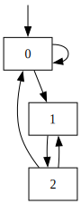
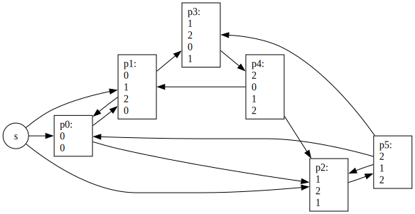
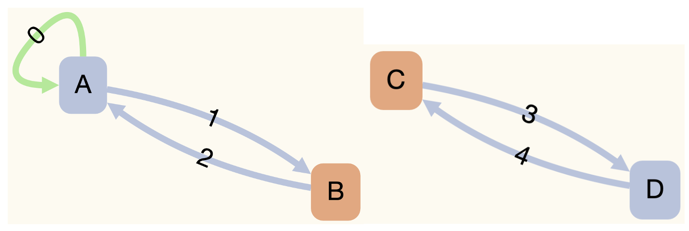
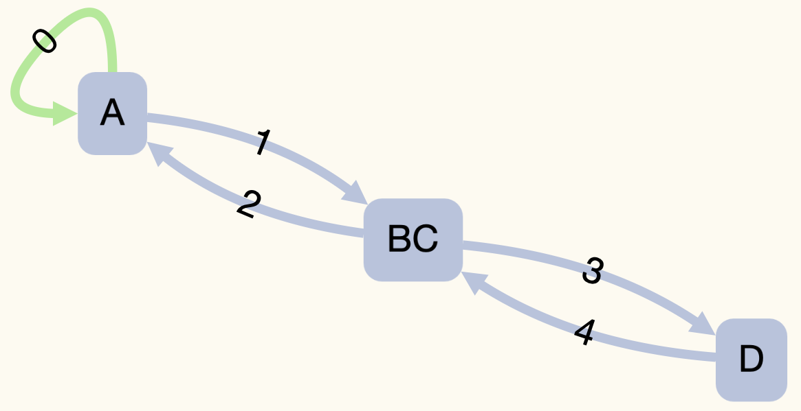

# Gwplus: GraphWalker Plus

Computes the shortest test path that satisfies a coverage criterion for a GraphWalker model.

## Table of Contents

* [How to Build](#how-to-build)
* [Usage](#usage)
* [Experiments](#experiments)
* [Side Uses](#side-uses)

## How to Build

Open a terminal execute the following commands to clone and build `gwplus`:

```
git clone https://github.com/yavuzkoroglu/gwplus.git
cd gwplus
make -e MODE=release
```

Now, you are ready to use `gwplus`. Execute the following command to see how to use `gwplus`.

```
bin/gwplus
```

## Usage

You should obtain the following output after executing `bin/gwplus`:

```
GWPlus: Fast Optimal Test Generator for GraphWalker

Usage: gwplus <options>

GENERAL OPTIONS:
  -c,--coverage COVERAGE       Set the coverage criterion
  -C,--copyright               Output the copyright message and exit
  -H,--help                    Output this help message and exit
  -h,--hyperpaths TXT-FILE     Output the hyperpaths to a TXT file
  -i,--input JSON-FILE         (Mandatory) An input GraphWalker model in JSON format
  -m,--measure CUSTOM-TEST(s)  Output coverage of custom test(s)
  -p,--pathgraph DOT-FILE      Output the path graph to a DOT file
  -r,--requirements TXT-FILE   Output the test requirements to a TXT file
  -s,--simplegraph DOT-FILE    Output the simple graph to a DOT file
  -t,--tests JSON-FILE         Output a unified GraphWalker model with predefinedEdgeIds
  -u,--unify JSON-FILE         Output a unified GraphWalker model with no tests
  -v,--verbose                 Timestamped status information to stdout
  -V,--version                 Output version number and exit

COVERAGE OPTIONS:
  vertex                       All vertices of a GraphWalker model
  edge                         (Default) All edges of a GraphWalker model
  edgepair                     All edge-pairs of a GraphWalker model
  NUMBER                       All edge paths up to a length (0=vertex, 1=edge, etc.)
  prime1                       All prime vertex paths of a GraphWalker model
  prime2                       All prime vertex paths and edges of a GraphWalker model
  prime3                       All prime edge paths of a GraphWalker model
  TXT-FILE                     Custom test requirements from a TXT file

CUSTOM-TEST OPTIONS:
  -b,--builtin                 Uses the predefinedEdgeIds of the input model
  TXT-FILE(s)                  Reads custom test(s) from TXT file(s)

EXAMPLE USES:
  bin/gwplus -i exps/001/m.json -c prime3 -s sg.dot -p pg.dot -h hp.txt -t test.json -v
  bin/gwplus -i exps/003/m.json -c 0 -t testpath.json -v
  bin/gwplus -i exps/003/m.json -c edge -m exps/003/t1.txt exps/003/t2.txt 
  bin/gwplus -i exps/002/m.json -u unified.json -v
```

### Example #1

```
bin/gwplus -i exps/001/m.json -c prime3 -s sg.dot -p pg.dot -h hp.txt -t test.json -v
```

The first option in this example is `-i exps/001/m.json`. This option sets the input GraphWalker model to a toy graph whose meta information is in `exps/001/info.json`. When opened in GraphWalker studio, this toy graph appears as follows:


The second option `-c prime3` sets the coverage criterion to the highest setting.

The third option `-s sg.dot` saves the simple graph of the toy graph. After executing the example command, you can print the graph to the terminal using `cat sg.dot` and produce the following result:

```
digraph SimpleGraph {
    node [shape="rectangle"];
    reset [shape="none", label="", width=0, height=0];
    2 [label="2"];
    1 [label="1"];
    0 [label="0"];
    reset -> 0;
    2 -> 1 [label=""];
    2 -> 0 [label=""];
    1 -> 2 [label=""];
    0 -> 1 [label=""];
    0 -> 0 [label=""];
}
```

A visualization of the above DOT graph is as follows:



The fourth option `-p pg.dot` saves the path graph of test requirements. A visualization of the path graph is below:



The fifth option `-h hp.txt` saves the hyperpaths of the path graph. You can print these hyperpaths using `cat hp.txt` and produce the following result:

```
h0: p5 p2
h1: h0 p0
h2: h1 p1
h3: p3 p4 h2
```

The sixth option `-t test.json` saves the model + a list of predefinedEdgeIds denoting a test path that satisfies the *prime3* coverage criterion. You can give this file to GraphWalker CLI using the following command:

```
java -jar graphwalker-cli-4.3.2.jar offline -m test.json "predefined_path(predefined_path)"
```

The GraphWalker CLI output should look like as follows:

```
{"currentElementName":"0"}
{"currentElementName":""}
{"currentElementName":"0"}
{"currentElementName":""}
{"currentElementName":"0"}
{"currentElementName":""}
{"currentElementName":"1"}
{"currentElementName":""}
{"currentElementName":"2"}
{"currentElementName":""}
{"currentElementName":"0"}
{"currentElementName":""}
{"currentElementName":"1"}
{"currentElementName":""}
{"currentElementName":"2"}
{"currentElementName":""}
{"currentElementName":"1"}
{"currentElementName":""}
{"currentElementName":"2"}
{"currentElementName":""}
```

The final option `-v` enables verbose messages in output. A correct execution should produce something similar to the following timestamped output:

```
[2024-03-14 20:59:06] - Verbose enabled.
[2024-03-14 20:59:06] - Input Model File = exps/001/m.json
[2024-03-14 20:59:06] - Coverage Criterion = Prime Edge Path Coverage
[2024-03-14 20:59:06] - Simple Graph Name = sg.dot
[2024-03-14 20:59:06] - Path Graph File = pg.dot
[2024-03-14 20:59:06] - Hyperpaths File = hp.txt
[2024-03-14 20:59:06] - Output Model File with Predefined Edges = test.json
[2024-03-14 20:59:06] - Creating Empty GraphWalker Model...
[2024-03-14 20:59:06] - Filling the GraphWalker Model using 'exps/001/m.json'
[2024-03-14 20:59:06] - Filling adjacency lists to optimize path generation...
[2024-03-14 20:59:06] - Starting Element is an EDGE
[2024-03-14 20:59:06] - # Vertices = 2
[2024-03-14 20:59:06] - # Edges = 3
[2024-03-14 20:59:06] - Saving the simple graph to 'sg.dot'...
[2024-03-14 20:59:06] - Generating/Loading Test Requirements...
[2024-03-14 20:59:06] - Generating Path Graph...
[2024-03-14 20:59:06] - Optimization Level = 0
[2024-03-14 20:59:06] - Saving path graph to 'pg.dot'
[2024-03-14 20:59:06] - Generating Hyperpaths...
[2024-03-14 20:59:06] - Saving hyperpaths to 'hp.txt'
[2024-03-14 20:59:06] - Generating Test(s)...
[2024-03-14 20:59:06] - # Hyperpaths = 2
[2024-03-14 20:59:06] - Test Length = 9
[2024-03-14 20:59:06] - Saving the test to 'test.json'...
[2024-03-14 20:59:06] - Finished.
```

### Example #2

```
bin/gwplus -i exps/003/m.json -c 0 -t testpath.json -v
```

The example command above generates the optimal test path that satisfies *vertex coverage*. Notice that the option `-c 0` is equivalent to `-c vertex`.

### Example #3

```
bin/gwplus -i exps/003/m.json -c edge -m exps/003/t1.txt exps/003/t2.txt
```

The example command above does NOT generate tests but measures the edge coverage of two tests. The output should look like as follows:

```
[ERROR] - Coverage Measurement is NOT implemented yet
```

**WARNING:** GWPlus cannot measure coverage for subgraphs, you must use unified models.

### Example #4

```
bin/gwplus -i exps/002/m.json -u unified.json -v
```

The example command above does NOT generate tests or measure coverage but generates a unified GraphWalker model by merging the original model's subgraphs.

The original model contains two subgraphs connected by shared vertices *B* an *C* as follows:



The unified model is as follows:



## Experiments

### Prerequisites

1. MacOS
2. Build *gwplus*: `make -e MODE=release`
3. GraphWalker CLI: `graphwalker-cli-4.3.2.jar` [https://graphwalker.github.io/#download](https://graphwalker.github.io/#download)
4. *gdate* utility: `brew install coreutils`

Execute the following BASH script to perform all the experiments:

```
./experiments.sh
```

## Side Uses

### Finding Shortest Paths

### Obtaining Line Graphs

It is possible to obtain a *line graph* with GWPlus. The following command produces the line graph of the toy GraphWalker model:

```
bin/gwplus -i exps/001/m.json -s linegraph.dot
```
